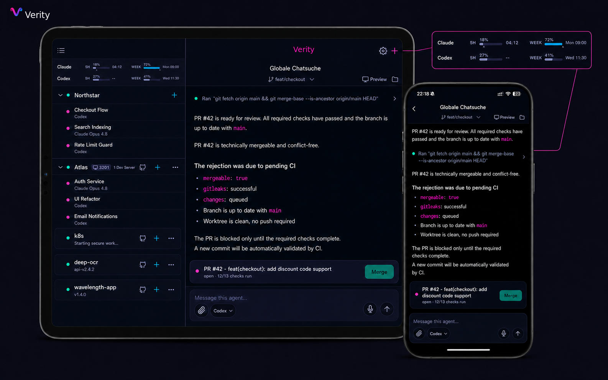

# Verity

**Run coding agents in a secure, isolated environment—without locking your
workflow to a single AI provider.**

Verity is a self-hosted platform for running coding agents across your
development projects. Use Claude Code, Codex, or open-source models through
OpenCode while agents work in isolated project sandboxes and parallel Git
worktrees and session history stays on your server.

Use Verity on iPhone, iPad, or Mac through the iPad app to start multiple agents,
see which sessions need attention, follow tool activity, answer permission
requests, and keep work moving away from your desk.



> [!WARNING]
> Verity is under active development and is not yet recommended for
> third-party production use. Backup and restore automation and some release
> security controls are still being completed. Review the
> [known limitations](SECURITY.md#known-limitations) and the
> [open-source readiness tracker](docs/open-source-readiness.md) before deploying.

## What Verity provides

- Persistent coding-agent sessions across your projects
- Concurrent agents with an isolated branch and worktree for every session
- Support for Claude Code, Codex, and compatible OpenCode providers
- An attention queue, live tool activity, and permission prompts
- Voice input, file attachments, and access to project files
- Visibility into agent branches, pull requests, and CI status
- Per-project container isolation on your own Docker host
- Brokered Claude and Codex credentials kept outside project sandboxes
- A self-contained deployment with PostgreSQL included

## Install

You need an x86-64 Linux host with Docker 25 or newer, the Docker Compose v2
plugin, and root or `sudo` access. ARM64, macOS, and Windows hosts are not
currently supported. The official installer provisions the Server, Runner, and
PostgreSQL, then prints a QR code for pairing the mobile app:

```sh
curl -fsSL https://verity.build/install.sh | bash
```

Before making changes, you can inspect the
[installer](https://verity.build/install.sh) or run its host checks only:

```sh
curl -fsSL https://verity.build/install.sh | bash -s -- --preflight
```

See the [deployment guide](deploy/README.md) for manual installation, advanced
configuration, upgrades, and recovery.

The mobile app source is included in this repository. Official App Store builds
and hosted connectivity are distributed separately and are not required by the
self-hosted core.

## Development

Verity is an npm-workspaces monorepo built with TypeScript and requires Node.js
24.19 or newer within the 24.x release line, or Node.js 26 or newer.

```sh
git clone https://github.com/heey-global/verity.git
cd verity
npm install
npm run build
npm test
```

The default test suite uses an in-process PGlite database and does not require a
running PostgreSQL server. Before submitting a change, also run:

```sh
npm run lint
npm run format
```

The main source areas are:

| Path               | Purpose                                        |
| ------------------ | ---------------------------------------------- |
| `apps/mobile`      | Expo and React Native mobile app               |
| `packages/server`  | Fastify control-plane API and WebSocket server |
| `packages/session` | Agent backends and session lifecycle           |
| `packages/store`   | PostgreSQL persistence and encrypted secrets   |
| `packages/events`  | Runtime-independent agent event model          |
| `deploy`           | Self-hosted deployment and operations tooling  |

Start with the [contribution guide](CONTRIBUTING.md) for the full development and
pull-request workflow. Architectural decisions are recorded in
[`docs/adr`](docs/adr), and the detailed system design is documented in the
[control-plane concept](docs/AGENT_CONTROL_PLANE_KONZEPT.md).

## Open-source scope

This repository contains the Apache-2.0-licensed, self-hosted Verity core and
mobile app, including the open Uplink client, connector, transport, and
protocols. A local installation does not require a paid hosted service.

The hosted Uplink service, hosted remote connectivity and sharing, managed
operations, and official App Store builds are separate and are not included
here. The [trademark policy](TRADEMARKS.md) applies to the Verity name and brand
assets.

## Community and security

- Read [CONTRIBUTING.md](CONTRIBUTING.md) before opening a pull request.
- Follow the [Code of Conduct](CODE_OF_CONDUCT.md) in project spaces.
- Report vulnerabilities privately as described in [SECURITY.md](SECURITY.md).
- Use [GitHub Issues](https://github.com/heey-global/verity/issues) for public bug
  reports and feature proposals.

## License

The source code in this repository is licensed under the
[Apache License 2.0](LICENSE). Third-party components remain subject to their
respective licenses.
