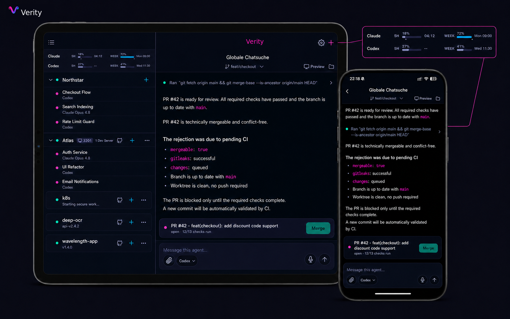

# Verity

[](https://github.com/Heey-Global/verity/actions/workflows/ci.yml?query=branch%3Amain)
[](https://scorecard.dev/viewer/?uri=github.com/Heey-Global/verity)
[](https://github.com/Heey-Global/verity/releases)
[](SECURITY.md#verifying-a-release)
[](LICENSE)

**Run a fleet of coding agents on your own server—and steer it from your
phone.**

Use Verity on iPhone, iPad, or Mac through the iPad app to start multiple
agents, see which sessions need attention, follow tool activity, answer
permission requests, and keep work moving away from your desk.

Agents work in isolated project sandboxes and parallel Git worktrees, session
history stays on your server, and the runtime is not tied to a single AI
provider: Claude Code, Codex, and open-source models through OpenCode are all
supported.



> [!NOTE]
> **Join the Verity beta.** Try the self-hosted setup and help us improve it
> with your feedback. For a TestFlight invitation to the app, email
> [hello@verity.build](mailto:hello@verity.build).
> Verity is still under active development; review the
> [known limitations](SECURITY.md#known-limitations) and the
> [open-source readiness tracker](docs/open-source-readiness.md) before deploying.

## What Verity is not

- **Not an editor.** Verity does not replace your IDE. There is no completion
  and no inline edit loop.
- **Not a prototype builder.** Agents work on your existing repositories and
  your existing Git workflow, not on generated starter applications.
- **Not a hosted service.** A local installation does not require a paid
  service from us.

## What Verity provides

Fleet:

- Persistent coding-agent sessions across your projects
- Concurrent agents with an isolated branch and worktree for every session
- An attention queue, live tool activity, and permission prompts
- Voice input, file attachments, and access to project files

Isolation and credentials:

- Per-project container isolation on your own Docker host
- Brokered Claude and Codex credentials kept outside project sandboxes

Workflow and deployment:

- Support for Claude Code, Codex, and compatible OpenCode providers
- Visibility into agent branches, pull requests, and CI status
- A self-contained deployment with PostgreSQL included

## Install

You need an x86-64 Linux host with Docker 25 or newer, the Docker Compose v2
plugin, and root or `sudo` access. ARM64, macOS, and Windows hosts are not
currently supported. The official installer provisions the Server, Runner, and
PostgreSQL, then prints a QR code for pairing the mobile app.

For a host running one active project sandbox, plan for **16 GiB of RAM and
4 CPU cores**. This is a sizing recommendation, not a tested minimum. Each
sandbox defaults to a 6 GiB memory limit and a CPU quota of 4 cores; these are
upper limits, not reserved resources. Leave room for the Server, PostgreSQL,
and the host. Smaller hosts need lower [resource limits](deploy/README.md#resource-guardrails);
multiple active sandboxes need additional capacity.

The mobile app connects on **port 8082** over TLS and pins the server certificate.
After pairing, authenticated API routes require a bearer token specific to the
paired device; only explicitly defined pre-authentication routes are exempt.
See [SECURITY.md](SECURITY.md) for the security model and known limitations.
Docker publishes this port on all host interfaces by default, and Docker's port
forwarding can bypass ufw rules. Restrict access to trusted devices or networks
and verify reachability from outside the host; see the
[deployment hardening guide](deploy/README.md#hardening-an-internet-reachable-host).

For the reference Docker deployment, allow these **TCP ports** from the devices
that need access:

| Default host ports | Purpose                                    | Access                                                              |
| ------------------ | ------------------------------------------ | ------------------------------------------------------------------- |
| `8082`             | Verity API and mobile app connection (TLS) | Trusted devices or networks                                         |
| `8100–8119`        | Local HTTP and WebSocket previews          | Trusted LAN or VPN clients only; previews have no access protection |

The API host port is configurable through `VERITY_API_HOST_PORT`; the local
preview range through `VERITY_LOCAL_PREVIEW_PORT_RANGE`. The deployment publishes
the range once, and each local share uses an available port. Services keep their own listening ports inside the sandbox; devices access them
through the allocated local preview port. No separate sandbox ports need
publishing or firewall rules.
Public sharing through Uplink needs no inbound port forwarding for this range;
do not expose local previews to the internet. See the
[ports and environment reference](deploy/README.md#ports--environment-reference)
for configuration details.

The bootstrap temporarily downloads a version-pinned cosign binary, checks its
embedded SHA-256 checksum, and verifies the Server image's release signature
before using its installation code. You do not need to install cosign yourself.
Download or verification failures stop installation; network access to GitHub,
the image registry, and Sigstore trust services is required.

Install with:

```sh
curl -fsSL https://verity.build/install.sh | bash
```

Before making changes, you can inspect the
[installer](https://verity.build/install.sh) or run its host checks only:

```sh
curl -fsSL https://verity.build/install.sh | bash -s -- --preflight
```

See the [deployment guide](deploy/README.md) for manual installation, advanced
configuration, upgrades, and recovery.

The mobile app source is included in this repository. Official App Store builds
and hosted connectivity are distributed separately and are not required by the
self-hosted core.

## Development

Verity is an npm-workspaces monorepo built with TypeScript and requires Node.js
24.19 or newer within the 24.x release line, or Node.js 26 or newer.

```sh
git clone https://github.com/heey-global/verity.git
cd verity
npm install
npm run build
npm test
```

The default test suite uses an in-process PGlite database and does not require a
running PostgreSQL server. Before submitting a change, also run:

```sh
npm run lint
npm run format
```

The main source areas are:

| Path               | Purpose                                        |
| ------------------ | ---------------------------------------------- |
| `apps/mobile`      | Expo and React Native mobile app               |
| `packages/server`  | Fastify control-plane API and WebSocket server |
| `packages/session` | Agent backends and session lifecycle           |
| `packages/store`   | PostgreSQL persistence and encrypted secrets   |
| `packages/events`  | Runtime-independent agent event model          |
| `deploy`           | Self-hosted deployment and operations tooling  |

Start with the [contribution guide](CONTRIBUTING.md) for the full development and
pull-request workflow. Architectural decisions are recorded in
[`docs/adr`](docs/adr), with supporting protocols, threat models, and runbooks
under [`docs`](docs).

## Open-source scope

This repository contains the Apache-2.0-licensed, self-hosted Verity core and
mobile app, including the open Uplink client, connector, transport, and
protocols. A local installation does not require a paid hosted service.

The hosted Uplink service, hosted remote connectivity and sharing, managed
operations, and official App Store builds are separate and are not included
here. The [trademark policy](TRADEMARKS.md) applies to the Verity name and brand
assets.

## Community and security

- Read [CONTRIBUTING.md](CONTRIBUTING.md) before opening a pull request.
- Follow the [Code of Conduct](CODE_OF_CONDUCT.md) in project spaces.
- Report vulnerabilities privately as described in [SECURITY.md](SECURITY.md).
- Use [GitHub Issues](https://github.com/heey-global/verity/issues) for public bug
  reports and feature proposals.

## License

The source code in this repository is licensed under the
[Apache License 2.0](LICENSE). Third-party components remain subject to their
respective licenses.
