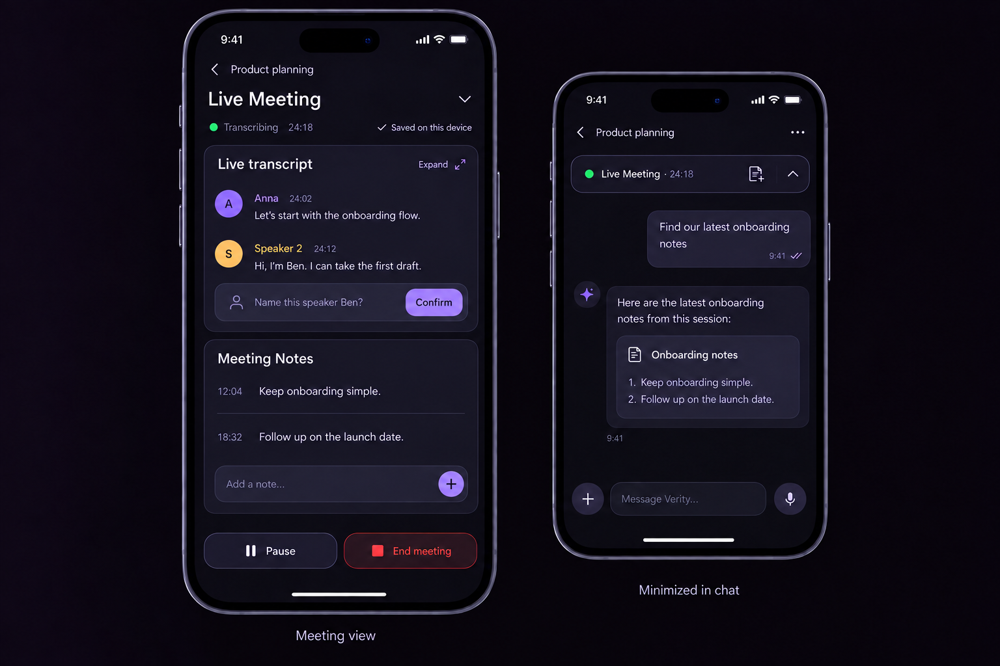

# Live Meeting

**Status:** Product concept; a local Nemotron meeting prototype is in progress. Long-session device validation and server synchronization remain open.
**Scope:** Session-bound mobile meetings, durable transcripts and notes, and project knowledge export.
**Related:** [Concept review](LIVE_MEETING_CONCEPT_REVIEW.md) and
[speech-to-text options](LIVE_MEETING_STT_OPTIONS.md), both from 2026-09-28. The engine direction
below follows the decision taken after that review.

## 1. Outcome and release boundaries

Capture long conversations without filling the chat composer. Let the person using Verity
take timestamped notes, continue working elsewhere in the app, and later process transcript
and notes together. Preserve their origin when storing them in the knowledge base.

| Stage | Included | Explicitly deferred |
| --- | --- | --- |
| Version 1 | Local live transcription with a selectable engine (Nemotron initially selected), timestamped notes, minimize/restore, durable recovery and knowledge export | Speaker separation, speaker names, calendar integration, LLM assistance and lock-screen continuation as a promised capability |
| Version 2 | Local speaker separation with FluidAudio, editable names and optional confirmed name suggestions | Automatic identification across meetings and calendar integration |
| Later, separately scoped | Optional meeting assistant, research, factual checks and critical questions | Not a prerequisite for either version above |

### Engine direction: Nemotron initially, FluidAudio for speakers

The first local meeting version selects FluidAudio Nemotron by default because its partial results
have worked best in the initial device test. This is a provisional product choice, not a measured
accuracy result for hour-long German meetings. Apple `SpeechTranscriber` and Parakeet Ultra remain
selectable. Speaker diarization in V2 uses FluidAudio, fed from the same microphone tap.
Both sit behind a transcription engine interface with Apple and FluidAudio implementations.
FluidAudio's Nemotron multilingual model provides short-interval streaming; Parakeet Ultra
processes overlapping audio windows of about 15 seconds and is a second FluidAudio candidate
when transcription quality outweighs update latency. Test both on meeting speech before confirming
a FluidAudio default. Within the Apple implementation, `DictationTranscriber` is a
configuration candidate alongside `SpeechTranscriber` because it is the only Apple module that
accepts custom vocabulary; see section 6.

Reasons to retain Apple as an option: no model download inside the app, model memory outside the app process,
a design built for unlimited session length, documented German support, and third-party benchmark
evidence that Apple's engine is strong on German speech. Reasons to keep FluidAudio: custom
vocabulary boosting, iOS 17 support, open models, and evidence that the Parakeet family handles
disfluent speech better. Risks to validate before confirming Nemotron as the V1 default: the iOS 27
restriction on background Neural Engine access for in-app models, the in-app model footprint, and
thin upstream iOS validation of the German streaming path on the target chips.

The ordinary microphone dictation feature remains unchanged for V1 and V2. As a later,
separately scoped follow-up, iOS dictation may migrate onto the same native module and Apple
`SpeechAnalyzer` path so that dictation and meetings share one audio pipeline; that migration
brings no accuracy gain by itself because `DictationTranscriber` uses the same model as today's
dictation, requires iOS 26, and must keep `expo-speech-recognition` as the fallback for Android
and for iOS versions before 26. No continuous audio-file archive is required by this concept; see
the open decision in section 4.

## 2. Entry points and ownership

The session's plus menu contains two distinct actions:

- **Transcribe Audiofile:** the existing import and transcription of a completed recording,
  such as an MP3, using the configured transcription backend. Rename the existing
  "Meeting audio" entry accordingly.
- **Live Meeting:** start the new live workflow in the current session.

Do not require a microphone long-press. A short microphone tap keeps its existing dictation
behavior. Starting a meeting must not automatically submit a chat prompt or start an agent.

A meeting belongs to its originating session. Navigating to another session or project does
not transfer that ownership. Allow one active meeting on the device initially; choosing
Live Meeting again opens the existing meeting. Coordinate microphone ownership with normal
dictation rather than allowing two capture sessions to compete.

## 3. Visual direction and interaction

The approved direction uses a quiet dark interface with subtle violet accents. The latest
layout places **Live transcript above Meeting Notes**.

This generated reference includes the proposed V2 speaker controls. V1 uses the same layout
but omits speaker avatars, speaker names and name suggestions. It is a design reference,
not a screenshot of working functionality or a guarantee of exact final dimensions.

### Expanded meeting

- Header: originating session, optional meeting title, elapsed time and minimize action.
- Separate statuses for transcription health, local persistence and server synchronization.
- Upper area: a bounded, scrollable live transcript with an option to inspect full history.
  Avoid re-rendering the entire hour-long conversation for every partial result.
- Lower area: Meeting Notes with timestamped entries and an Add a note input.
- Controls: Pause, Resume when paused, and End meeting.

Anchor a new note to the meeting time at which typing begins, not its submission time.
Persist draft edits and allow subsequent editing and timestamp correction. Tapping a note's
timestamp opens the corresponding transcript position. Notes remain visibly distinct from
spoken content.

When the keyboard opens, keep the note input directly above it and reduce or scroll the
transcript area. Do not obscure the active input or end the meeting when keyboard state changes.
Adapt this hierarchy to iPad rather than stretching phone-sized controls across the screen.

### Minimized meeting

Keep a compact app-level meeting bar visible while navigating. It shows activity, elapsed
time and any interruption or unsaved state, with actions to restore the meeting or add a
quick note without leaving the current task. The chat mockup places this bar below its header;
the application shell must reserve space for it rather than cover content.

Capture and persistence belong to an app-level service, not the mounted meeting screen.
In-app minimization and operating-system background execution are separate requirements.

### Foreground promise and lock screen

V1 promises capture while the app is in the foreground, with the screen kept awake during a
meeting. The `audio` background mode is enabled so the microphone session survives short app
switches and the lock button; whether transcription continues on a locked screen is engine
dependent and is a validation gate, not a promise:

- Apple's engine runs in a system process and is plausibly unaffected by the iOS 27 restriction
  on background Neural Engine access for in-app models. This must be tested on the target devices.
- FluidAudio models run inside the app. Continued Neural Engine inference in the background on
  iOS 27 requires the Background Inference entitlement together with `BGContinuedProcessingTask`,
  which shows a Live Activity, can be cancelled by the person and may be terminated by the system.
  Treat this as a separately gated capability for the FluidAudio path and for V2 diarization.

Whatever the outcome, the transcript must show where capture stopped. Never claim to recover
speech that occurred while capture or recognition was not running.

### Ending a meeting

Persist final results and outstanding note edits, then show a meeting card in the originating
session. The card opens transcript and notes and offers subsequent processing through chat.
Show pending synchronization explicitly; local completion is not proof of server storage.

## 4. Version 1: transcription, notes and durability

Transcribe with the selected local engine. Nemotron is initially selected, with partial snapshots
and final text. Check module availability and device support at runtime and expose model download
progress and failures. For the Apple option, check locale assets through `AssetInventory` and use
volatile results with word-level audio time ranges. Do not fall back silently to network recognition
or another engine; a fallback is a visible choice.

Live microphone audio reaches the engine through a Verity Expo module in Swift, following the
existing inline-module path in `apps/mobile/native/`. The module owns the audio session, the
engine, and in V2 the diarizer; JavaScript receives finalized and volatile segments as events and
never handles raw audio. The engine interface must allow the FluidAudio implementation to be
selected without changes above the module boundary.

Persist text segments and notes incrementally on the device in a write-ahead store such as
`expo-sqlite`; the app's current AsyncStorage is not suitable for appending thousands of segments.
Do not rely on component state, an in-memory map or saving everything at End meeting. Persist
provisional text as provisional and replace it when final recognition arrives rather than
duplicating it. After a crash, restored provisional text must remain distinguishable.

Use stable meeting and segment identifiers, revisions and a common meeting-relative timeline.
Pauses and interruptions must be represented explicitly so that notes retain their temporal
relationship to speech. A resumable, durable synchronization queue retries idempotently at
segment level and survives app and server restarts; the existing push outbox is the closest
pattern but the meeting queue is new work. Mark content synchronized only after durable server
acknowledgement.

After restart, recover saved meetings and pending work, and show where capture stopped. State
the loss budget explicitly: at most the speech since the last finalized segment plus the time
until relaunch. Without a retained audio recording, missed speech and recognition mistakes cannot
be reconstructed from sound later. Speaker analysis also cannot be added retrospectively to a V1
text-only meeting.

**Open decision: retained audio buffer.** An opt-in rolling on-device audio file, deleted at
meeting end unless kept, is the only way to close a capture gap after the fact. The review
recommends offering it as an opt-in and enabling it during the device test phase. The product
decision is pending.

Interruptions, microphone revocation, engine errors, missing language assets, low storage and
calls must yield an honest visible state. Resume when supported without hiding gaps or
discarding already persisted content. Degrade visibly under memory or thermal pressure: drop
diarization first, then reduce update frequency, then switch engine as an explicit choice, then
stop with a visible state.

### Knowledge destination

For a project-associated session, export one coherent meeting source containing metadata,
timestamped transcript and a separate timestamped notes section into project knowledge.
Follow the existing meeting-source storage conventions; the exact storage schema is an
implementation decision. Preserve structured identifiers and revisions alongside readable export.
Without a project, retain the meeting on its session and permit explicit later project assignment.

Summaries, decisions and tasks are derived material linked to that source. They must not replace
the transcript or silently turn a personal note into something said by a participant. Export
failure is retryable and must not erase the locally saved meeting.

## 5. Version 2: speakers and names

Add FluidAudio diarization to the same microphone timeline. The expected participant count selected
before recording chooses streaming Sortformer for up to four (including "Not sure") or LS-EEND for
five to ten. Validate that choice with German meetings, latency and resource measurements. Transcription and diarization
are separate workloads: Apple's engine outside the app process, the FluidAudio diarizer inside it.
Word-level time ranges from the transcriber are aligned with speaker turns from the diarizer.

Documented limits to design for: Sortformer handles at most four speakers with very stable
identities and misses quiet speech; LS-EEND handles up to ten depending on variant, is less
stable, and documents recordings up to one hour. Diarization error rates of 20 to 30 % are normal
for the field, so roughly one in four or five seconds of speech will be misattributed or missed.
Show the supported speaker count to the person, and define what happens to speaker identities at
a diarizer state reset in meetings longer than one hour.

- Initially display stable labels such as Speaker 1 and Speaker 2 with consistent colors.
- Make every speaker label tappable. Renaming updates that speaker's contributions throughout
  the current meeting, including previous contributions.
- Allow correcting an individual segment's attribution and merging duplicate speaker identities.
  A rename alone must not be the only way to repair misattribution.
- Use an unknown/uncertain attribution when evidence is insufficient; do not force a name onto
  overlapping or ambiguous speech.
- Optionally recognize clear introductions such as "I'm Anna" locally and offer "Name this
  speaker Anna?" for confirmation. Mentioning a name is not proof of speaker identity.
- Calendar attendees may be considered later as name suggestions; an invitation does not
  identify a voice. No calendar access is required in V1 or V2.

Do not retain reusable voice profiles or identify people across meetings as part of this scope.
Speaker inference failing must not stop transcription or note persistence. The app downloads
FluidAudio model bundles directly from the provider through the pinned library and caches them on
the device. The Verity server does not relay model files or raw meeting audio. Missing or damaged
downloads need a clear retry path; model revisions and device resource usage must be re-validated
on every library bump.

## 6. Vocabulary support

Apple's Speech framework offers custom vocabulary in two forms: `AnalysisContext.contextualStrings`
(up to 100 short phrases such as Verity, participant names and project terms) and custom language
models built with `SFCustomLanguageModelData`, which can also carry pronunciations. Checked against
the iOS 27 documentation on 2026-09-28, both are documented for `DictationTranscriber` only.
`DictationTranscriber` uses the same on-device model as the existing microphone dictation and
`SFSpeechRecognizer`, runs under `SpeechAnalyzer` like any other module, and additionally accepts
content hints such as far-field speech. The long-form `SpeechTranscriber` has neither a context
option nor a language-model option in its initializers, and iOS 27 added no Speech framework
symbols and no WWDC26 session that changes this.

The engine benchmark in section 8 therefore compares four Apple-side and FluidAudio-side
candidates for vocabulary handling:

- `DictationTranscriber` with contextual strings and the far-field hint: vocabulary boosting on
  the model already valued for dictation, at the cost of possibly lower long-form accuracy.
- `SpeechTranscriber` without boosting, compensated by tolerant matching of likely name variants
  on the device, the Ask Verity button as the reliable path, and server-side post-correction of
  participant and project names against a supplied list.
- FluidAudio Nemotron with decode-time vocabulary boosting.
- FluidAudio Parakeet Ultra, measuring name accuracy and whether the added latency is acceptable
  for a live transcript. Validate vocabulary support separately before promising it.

Choose by measured recognition of names and project terms on meeting speech, not by feature list.

Vocabulary boosting improves recognition likelihood; it neither guarantees spelling nor proves
that the assistant was addressed. It does not require LLM analysis of the meeting.

## 7. Later extension: an optional meeting assistant

This section preserves the discussed direction but does not expand V1 or V2 delivery scope.

| Mode | Behavior |
| --- | --- |
| Off | Transcription and notes only; no meeting content sent for LLM assistance and no name-triggered actions |
| On request | Respond to Ask Verity or locally detected direct address |
| Auto | Also evaluate new finalized sections and selectively research important claims |

Default to Off unless explicitly enabled. Distinguish local transcription from any external
LLM processing. Transcript segments reach the Verity server in every mode because durability and
knowledge export require it; Off turns off submission to the configured model provider and any
name-triggered action. Explain which selected conversation context goes to the provider; include
personal notes in that context only when explicitly enabled. Turning assistance off stops new
submissions and cancels pending work where possible; it cannot retract data already sent.

Deliver On request before Auto. Bind one agent session per meeting on the server, feed it
finalized transcript deltas, and give it the knowledge folder and web search it already has;
do not build a new model client. Run Auto as a scheduled triage turn in that same session, behind
a flag, with per-meeting budget and frequency caps, and evaluate it offline on recorded meetings
before enabling it live. A lightweight full-text index over project knowledge sources is a
prerequisite for Auto's contradiction checks, not for On request.

For voice requests, combine tolerant matching of likely name variants with an addressed
question. Provide visible activation feedback and an Ask Verity button. A local wake-word model is
a possible later improvement, not a guaranteed feature. Ordinary conversation and retrieved
documents are context, not authorization to execute external actions.

In Auto, periodically assess new finalized speech with a bounded running summary, meeting goal
and unresolved issues. Identify decision-relevant assumptions, concrete factual claims and
contradictions. Retrieve project sources for internal claims and current authoritative web sources
for external claims. Reassess relevance after research: the conversation may already have resolved it.

Show a compact, dismissible card between transcript and notes only when useful. Include source,
source date, uncertainty and the triggering meeting position. Deduplicate findings, limit frequency
and research budgets, and prioritize direct requests. An inability to verify is not evidence that
a participant is wrong. Assistance must never block capture, persistence or synchronization.

Responses are text first; reading aloud is explicit. Accepted findings can become attributed notes
with source links. Do not automatically send messages, modify external systems or turn unconfirmed
suggestions into commitments. Research and questioning remain within the self-hosted core boundary.

## 8. Devices and verification gates

Requested test devices are iPhone 15 Pro and iPad Pro 11-inch (4th generation), with system
version 27 as supplied by the user. This is a target test matrix, not a compatibility claim.
Verify the exact installed OS/build, `SpeechTranscriber` device support and locale assets, and
the selected FluidAudio model requirements on each device.

Before V1 commits to an engine, run the same German meeting recordings through
`SpeechTranscriber`, `DictationTranscriber` with contextual strings, FluidAudio Nemotron and
Parakeet Ultra on both devices and compare: word error rate overall and on names and project
terms, delay behind speech, memory, heat over 60 minutes, and behavior on a locked screen.

### In-app engine selection for testing

The engine is user-selectable inside the app during the test phase, so that the comparison can be
run on the real devices without rebuilding:

- A meeting settings entry lists the available engines with their state: Apple `SpeechTranscriber`,
  Apple `DictationTranscriber` with contextual strings, FluidAudio Nemotron and FluidAudio
  Parakeet Ultra, each showing device support, installed assets or models, and download size.
  Selection applies to the next meeting and can be overridden per meeting from the start screen.
- Every meeting records which engine, model revision and settings produced it, so results stay
  comparable and the choice is visible in the meeting card.

The selection stays available after the test phase as an advanced setting with a sensible
default. Comparing engines on the same audio is done outside the app with the recordings from
these test meetings; no in-app comparison mode is planned.

V1 acceptance requires:

- Real German speech through the selected engine, including names and project terminology.
- A 60-minute meeting with bounded memory, measured latency, heat and battery use on both devices.
- Notes remaining editable and correctly anchored during partial transcript revisions, pauses
  and keyboard transitions.
- Continued capture while navigating the app and accurate minimize/restore behavior.
- Explicitly tested screen lock, backgrounding and audio interruptions per engine; document any
  restrictions and, for the FluidAudio path, the entitlement outcome.
- Recovery of persisted text and notes after forced termination; clear marking of capture gaps.
- Network loss, retries, duplicate requests and app/server restart without duplicated or lost
  acknowledged content; eventual session card and knowledge export.
- Clear handling of missing language assets, missing or corrupt models, insufficient storage and
  microphone conflicts.

V2 additionally requires multi-speaker reference conversations, rapid turns, similar voices,
overlap, speaker-count limits, rename propagation and attribution corrections, plus iOS 27
specific checks: int8 encoder loading on A17 Pro and M2, Neural Engine memory attribution to the
app, and a 60-minute soak with transcription and diarization running together. Measure the extra
resource cost. Do not infer iPhone performance from desktop benchmark numbers or SDK adoption.
Add the model and library license attributions to the third-party notices.

This Linux workspace cannot perform Xcode builds or physical-device audio tests. Native build
validation and the device matrix remain required before claiming readiness.

## 9. Research references and current implementation anchors

External documentation is evolving. Recheck and pin compatible versions before implementation;
reported SDK support is not a completed Verity integration.

- [Apple SpeechAnalyzer](https://developer.apple.com/documentation/speech/speechanalyzer), [SpeechTranscriber](https://developer.apple.com/documentation/speech/speechtranscriber), [DictationTranscriber](https://developer.apple.com/documentation/speech/dictationtranscriber), [AnalysisContext.contextualStrings](https://developer.apple.com/documentation/speech/analysiscontext/contextualstrings)
- [iOS and iPadOS 27 release notes](https://developer.apple.com/documentation/ios-ipados-release-notes/ios-ipados-27-release-notes) and [Background Inference entitlement](https://developer.apple.com/documentation/bundleresources/entitlements/com.apple.developer.background-tasks.continued-processing.inference)
- [FluidAudio package and platform declarations](https://github.com/FluidInference/FluidAudio/blob/main/Package.swift)
- [FluidAudio model overview](https://github.com/FluidInference/FluidAudio/blob/main/Documentation/Models.md)
- [Speaker diarization](https://github.com/FluidInference/FluidAudio/blob/main/Documentation/Diarization/GettingStarted.md)
- [Custom vocabulary](https://github.com/FluidInference/FluidAudio/blob/main/Documentation/ASR/CustomVocabulary.md)
- [Apple contextual strings on the legacy path](https://developer.apple.com/documentation/speech/sfspeechrecognitionrequest/contextualstrings)
- [Hedy live assistance product reference](https://www.hedy.ai)
- Existing dictation: `apps/mobile/hooks/useVoiceInput.ts`.
- Existing inline Swift modules: `apps/mobile/native/`.
- Existing plus menu: `apps/mobile/lib/attachMenu.ts`.
- Existing file transcription routes: `packages/server/src/meeting-transcript-routes.ts`.
- Existing long-file transcription worker: `deploy/bin/verity-transcribe-meeting`.

The existing completed-file upload and transcription workflow is reusable reference code, not
an already durable live-meeting service. It must not be presented as implementing this concept.
