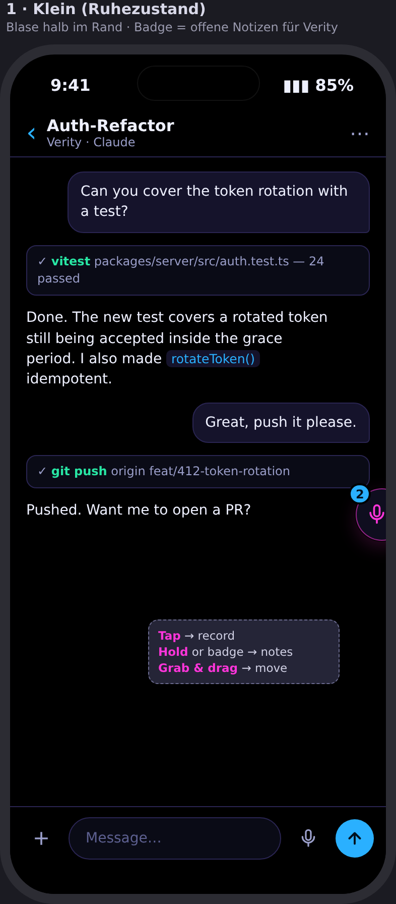
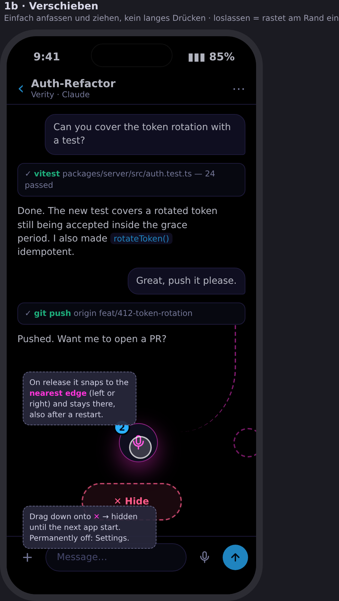
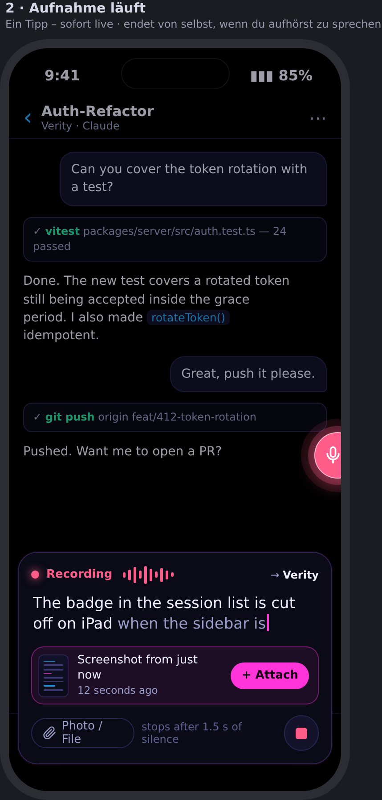
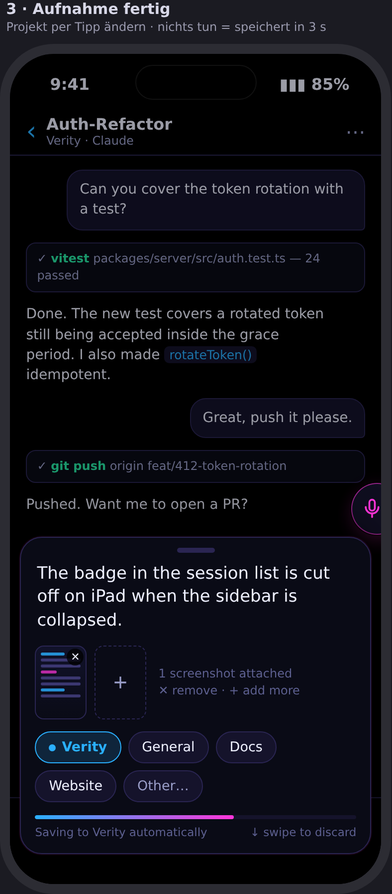
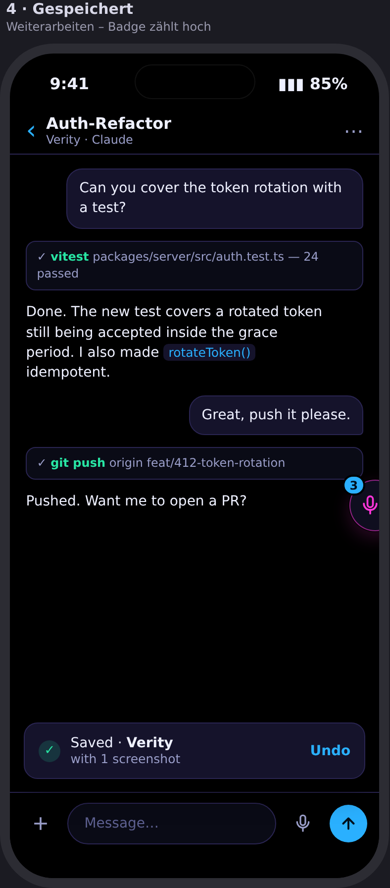
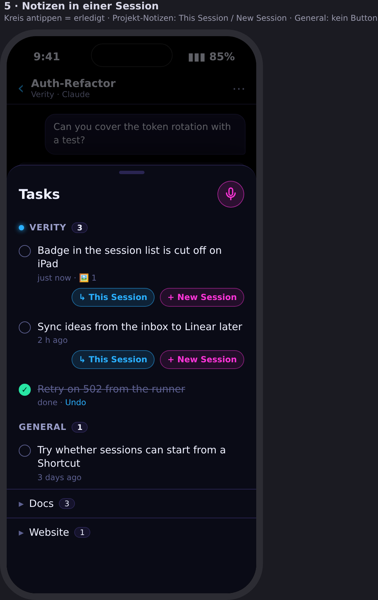
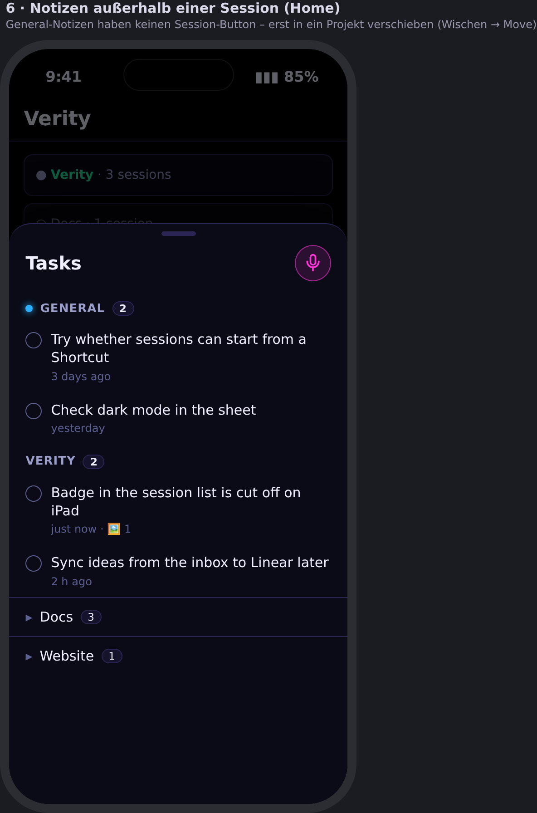
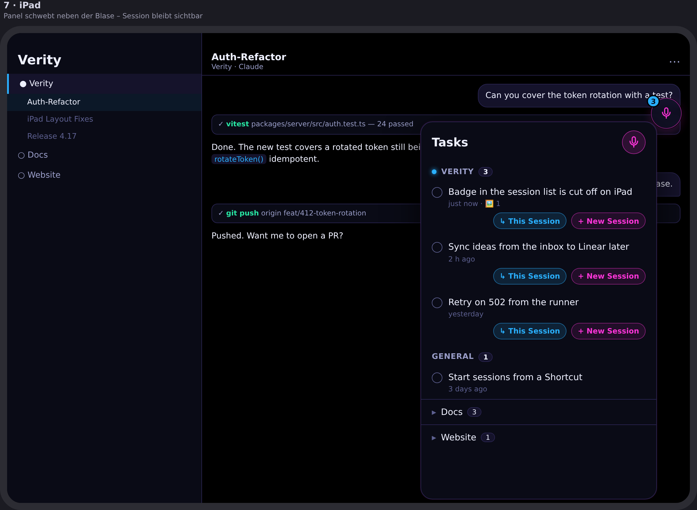

# Tasks and quick capture

**Status:** Proposed — concept and mockups, no implementation yet
**Scope:** Verity store, server, MCP gateway, session conductor, and mobile client

## 1. Outcome

One durable list of tasks per user that is fed from two directions and read from
both:

- **Quick capture.** From anywhere in the app, tap a floating microphone bubble,
  speak a thought, and have it saved in under five seconds with no further tap.
  The capture knows the current project and session.
- **Agent tasks.** When an agent produces several follow-up steps that do not fit
  into the current turn — audit findings, review results, "do this later" — it
  records them as tasks instead of keeping them only in its context. The list
  survives context compaction, backend switches, and session restarts.

From the same list the operator can check items off, move them, and hand them to
an agent: into the running session or into a new session in the task's project.
The agent checks off what it finishes, so the operator sees progress without
reading the transcript.

A task is a prompt in waiting, not a project-management artifact. The feature
does not replace GitHub issues and stays private to the user who owns it.

## 2. Scope and boundaries

In the first version:

- One kind of entry. No types, tags, priorities, due dates, or AI rewriting.
- Tasks belong to a project or to a fixed **General** bucket (no project).
- Tasks are private to their owner, also inside shared projects.
- Attachments: images and files captured with the task, reused when the task is
  sent to a session.
- Offline capture: a task is stored on the device first and synced later.
- Agent access through one MCP tool; open tasks assigned to a session are
  injected into that session's prompt on every turn.

Deliberately out of scope for the first version, kept as a later list:

- AI-generated title and prompt, automatic project detection, duplicate hints.
- Share sheet, Siri Shortcut, widgets, Watch, capture during live meetings.
- Automatic status feedback from merged pull requests.
- Reminders for stale tasks, weekly digests.
- Creating GitHub issues from tasks.
- A project picker for General tasks (see §4.5).

## 3. Relationship to native agent checklists

Claude Code, Codex, and OpenCode keep their own per-turn plan (TodoWrite /
TaskCreate / ACP `plan` updates). Verity already renders those as a checklist in
the chat (`packages/session/src/acp-adapter.ts`, `PlanCard` in
`apps/mobile/app/session/[id].tsx`). That checklist stays what it is: the
agent's working plan for the current turn, living in the agent's context and the
transcript. It is not persisted as tasks and is not exposed through the MCP tool.

Verity tasks are the durable layer above that: the backlog the operator and the
agent agree on. The agent prompt rules in §6.3 tell the agent when something
belongs to the durable list rather than the turn plan.

Note that the Claude Code CLI only exposes its native task tools to models on an
internal allow list unless `CLAUDE_CODE_ENABLE_TODO_TOOLS` is set; the sandbox
spawn broker sets that variable. This is independent of Verity tasks.

## 4. Operator experience

Mockups live in `docs/assets/tasks/` (`mockup.html` is the editable source).
UI copy is English.

### 4.1 Bubble



- A 52 pt round microphone button docked half outside the screen edge, about
  60 % opaque, so it covers almost nothing. Right edge by default.
- **Tap** starts recording. **Long-press, or tap the badge,** opens the tasks
  panel. **Grab and drag** moves it; a movement over 6 pt is a drag, below that
  a tap. On release it snaps to the nearest side edge with a haptic tick. Side
  and vertical position are persisted per device.
- **Badge:** the number of open tasks for the current context (§4.4). Hidden at
  zero.
- Dragging the bubble onto the **✕ Hide** zone at the bottom hides it until the
  next app start. A Settings toggle turns the feature off permanently.
- The bubble is hidden while the keyboard is open, during onboarding and search,
  while the capture card is shown, and while the active-meeting overlay is shown.



### 4.2 Capture

The fast path is tap, speak, carry on. No further tap is required.



1. Tap: on-device speech recognition starts immediately
   (`apps/mobile/hooks/useVoiceInput.ts`). A compact card at the bottom shows the
   transcript live, a level meter, the target project, and a stop button.
2. Recording ends after **1.5 s of silence** or on stop. The transcript remains
   editable.
3. If a screenshot was taken in the **last two minutes**, the card offers it with
   one tap ("+ Attach"). "Photo / File" opens the system picker for anything
   else. Attachments show as thumbnails; ✕ removes, + adds more.



4. After recording the card shows the text, attachments, and one row of
   **project chips**: the current project preselected, then **General**, then
   the two or three most recently used projects, then "Other…". A thin
   **3 s countdown** runs underneath.
   - Do nothing: the task is saved to the preselected target.
   - Tap a chip: saved there immediately.
   - Tap the text: countdown pauses for editing.
   - Swipe down: discard.



5. A toast "Saved · Verity" with **Undo** for about four seconds; the badge
   increments. Saving is local first (§7.5), so the toast never waits for the
   network.

### 4.3 Tasks panel



- iPhone: a bottom sheet (~70 %). iPad / wide layout (`width >= 900`): a
  floating panel anchored next to the bubble, so the session stays visible.
- Sections, top to bottom:
  1. **This session** — tasks assigned to the open session (only in a session).
     Shows done/total, e.g. `3/8`.
  2. **Current project** — open tasks of the project not assigned to a session.
  3. **General**.
  4. **Other projects**, collapsed, each with its count.
  Outside any project context only General is expanded.
- Each row: a **check circle** (tap = done, with Undo in the row), title, age,
  attachment count, an origin marker (microphone for operator, agent icon for
  agent-created), and the implement buttons from §4.5.
- Swipe reveals **Done**, **Move** (to another project or General), and
  **Delete**. Long-press opens an edit sheet for the text.
- A microphone button at the top captures from inside the panel.
- Footer: "Show done (n)".




### 4.4 Context

The context decides the capture default, the badge count, and the panel
ordering. It is derived from the router state the root layout already reads
(`apps/mobile/app/_layout.tsx`, `usePathname` + `useGlobalSearchParams`):

| Screen | Context |
|---|---|
| `session/[id]` | that session and its project |
| `project/[id]/*` | that project |
| wide layout with a selected session (`params.selected`) | that session and its project |
| anything else | General |

The derivation is a pure, tested helper in `packages/mobile`.

### 4.5 Implementing a task

| Task | In a session of the task's project | Elsewhere |
|---|---|---|
| Project task | **↳ This Session** and **+ New Session** | **+ New Session** |
| General task | no button | no button |

- **↳ This Session** assigns the task to the open session (`session_id`) and
  sends a turn (§6.4). The agent now sees the task on every turn and checks it
  off when done.
- **+ New Session** creates a session in the task's project through the existing
  create flow (`apps/mobile/app/new.tsx`, `lib/startSession.ts`) with the task
  assigned before the first turn. The first prompt is the task text plus its
  attachments.
- A General task has no project to run in. To implement it, move it to a project
  first (swipe → Move). A project picker on the button is a later refinement.
- Multi-select in the panel sends several tasks in one turn.
- A task sent to a session moves to `in_progress`; the row links to the session.

## 5. Data model

New table `tasks` in `packages/store` (migration after the current latest,
`0139_browser_sessions`), module `packages/store/src/tasks.ts` exported from
`index.ts`, with tests.

| Column | Notes |
|---|---|
| `id` | uuid, minted by the client so that saves are idempotent |
| `owner_user_id` | the user; every read and write is owner-scoped |
| `project_id` | nullable; null is General. `ON DELETE SET NULL`, so a deleted project turns its tasks into General instead of losing them |
| `session_id` | nullable; the session the task is assigned to. `ON DELETE SET NULL` |
| `source_session_id` | nullable; where it was captured, for display only |
| `origin` | `user` or `agent` |
| `title` | the task text; encrypted at rest with the store's `SecretCipher` like other user content |
| `detail` | nullable, encrypted; context the agent needs to implement the task on its own (file, risk, idea) |
| `attachments` | jsonb list of `{ hash, filename, mimeType }` referencing the content-addressed `attachments` table |
| `status` | `open`, `in_progress`, `done`, `dropped` |
| `result` | nullable, encrypted; short note written when completing or dropping |
| `sort` | integer ordering within a section |
| `revision` | integer, incremented on every write, used for optimistic concurrency and change detection |
| `created_at`, `updated_at`, `completed_at` | timestamps |

Attachments are stored through the existing `putAttachment` path
(`packages/store/src/store.ts`) and read through `GET /attachments/:hash`. That
route's existence check (`sessionHasAttachment`) must also accept hashes
referenced by one of the caller's tasks.

## 6. Agent integration

### 6.1 MCP tool `verity_tasks`

Added to `gatewayToolNameSchema` (`packages/secret-contracts/src/audit.ts`),
`TOOL_SCHEMAS` / `TOOL_DESCRIPTIONS` (`packages/server/src/mcp-gateway.ts`),
`servedTools` (`packages/server/src/embedded.ts`), and handled in
`invokeTool` in `packages/server/src/server.ts` next to
`verity_publish_session_progress`. The caller's session id comes from the
per-turn bearer (`resolveCaller`); the agent never names a session.

| Action | Effect |
|---|---|
| `list` | open and in-progress tasks of this session; with `scope: "project"` also the unassigned tasks of the session's project. Never other projects. |
| `add` | one or more tasks `{ title, detail? }`, assigned to this session, `origin: agent` |
| `update` | change `title`, `detail`, `status: in_progress` |
| `complete` | set `done` with a short `result` |
| `drop` | set `dropped` with a `result` explaining why |

The tool runs without an approval card (`hasStandingAuthorization` branch), like
`verity_present_plan`: it writes only to the caller's own list and cannot delete.
Every write bumps `revision` and emits the event in §6.5.

### 6.2 Prompt injection

`buildRunOpts` in `packages/session/src/conductor.ts` appends a short
**Assigned tasks** section to the system prompt on every turn, also on resumed
contexts, when the session has open or in-progress tasks:

```
# Assigned tasks (verity_tasks)
Open tasks for this session. Update their status with verity_tasks as you work.
- #3 (in progress) Rate-limit the login route
- #4 Badge cut off on iPad when sidebar collapsed · 1 attachment
```

Only tasks with `session_id = this session` are injected; project backlog and
General stay out of the prompt and are available through `list`. The section is
capped (titles and ids only, at most 30 rows, then "… n more"). Because the
section is rebuilt from the database each turn, compaction or a backend switch
cannot lose it. The approach mirrors how `PLANNING_ACTIVE_SYSTEM_PROMPT` is
attached today.

Changes made in the app between turns are summarised in the same section
("The user marked #2 done and dropped #5"), computed from `revision` since the
last turn.

### 6.3 Agent rules

A prompt section beside the planning and memory rules, applied through
`turnSystemPrompt`:

- **When to add:** persist agreed work, including accepted audit findings, agreed
  follow-ups and actionable steps of a user-approved plan, even when there is
  only one task. Unaccepted proposals remain in the conversation. Creating a
  task does not authorize execution.
- **Native checklist bridge:** the agent records these agreed outcomes through
  `verity_tasks`; native TodoWrite / TaskCreate / ACP snapshots are not blindly
  mirrored. File reads, test commands and other small implementation steps stay
  in the native checklist. List existing tasks first and reuse matching tasks
  when a plan is repeated, resumed or revised. Update the durable task as its
  native implementation checklist progresses; complete only after verification.
- **How to write:** each task self-contained, with the context needed to do it
  in a fresh session in `detail` — file, risk, proposed fix.
- **Status:** `in_progress` when starting; `done` only after implementation and
  verification, with a one-line result; `dropped` with a reason rather than
  silently left open.
- **End of turn:** state what is still open and offer the next task as a Quick
  Action ("Work on #4").

### 6.4 Sending a task to a session

"↳ This Session" posts a normal turn through `POST /sessions/:id/turns` with a
prompt built by the client:

```
Work on task #4: Badge cut off on iPad when sidebar collapsed
<detail, if any>
```

plus the task's attachments as prompt attachments. The server marks the task
`in_progress` and sets `session_id` in the same request (`PATCH /tasks/:id`
before the turn). The agent sees the task in the injected section from that turn
on.

### 6.5 Events

A new `tasks_updated` agent event (`packages/events/src/events.ts`) carries
`{ sessionId?, projectId?, taskIds, origin }`. The server appends it to the
session stream (`eventStore.appendEvent` + `bus.publish`, like `emitNotice`), so
the open panel and the badge refresh live and the chat can render a compact
line ("Agent added 5 tasks", "#3 done ✓") linking to the panel.

## 7. Server and client

### 7.1 Routes

`packages/server/src/tasks-routes.ts`, registered in `server.ts`:

| Route | Purpose |
|---|---|
| `GET /tasks?projectId=&sessionId=&status=` | list, owner-scoped |
| `PUT /tasks/:id` | create or replace (idempotent by client id) |
| `PATCH /tasks/:id` | partial update with `expectedRevision` |
| `DELETE /tasks/:id` | delete |

### 7.2 Authorization

Every route checks ownership. When `projectId` is set, the caller also needs
`read` on that project (`authorizePairedRoute` rules in
`packages/server/src/paired-route-policy.ts`, backed by
`store.hasProjectPermission`). Assigning a task to a session requires `execute`
on the session's project, because it leads to a turn. The route-scope guard test
(`route-scopes.test.ts`) must list the new routes.

### 7.3 Client API

`packages/mobile/src/api.ts`: `listTasks`, `saveTask`, `updateTask`,
`deleteTask`, with zod schemas shared with the server.

### 7.4 Mobile modules

- `apps/mobile/lib/tasksStore.ts` — cache, offline queue, badge counts
  (pattern: `settingsStore.ts`, `liveMeetingStore.ts`).
- `apps/mobile/components/QuickCaptureBubble.tsx` — drag, snap, badge, hide
  zone (`react-native-gesture-handler` + `reanimated`, drag pattern as in
  `ActiveMeetingOverlay.tsx`), mounted in `HydratedRoot` (`app/_layout.tsx`).
- `apps/mobile/components/QuickCaptureCard.tsx` — recording, silence end,
  attachment offer, chips, countdown, undo.
- `apps/mobile/components/TasksPanel.tsx` — sheet / iPad panel, sections,
  actions, multi-select.
- A pure context helper in `packages/mobile` (§4.4).
- Settings toggle "Show capture bubble".

### 7.5 Offline

A capture is written to the local store first and queued. The queue retries with
backoff and uses the client-minted id, so a retry after a timeout cannot create a
duplicate. Server-side changes (agent updates, other devices) are merged by
`revision`; the higher revision wins, and a local pending write on an older
revision is re-applied as a PATCH with `expectedRevision` or surfaced as a
conflict in the row.

## 8. Delivery

Three pull requests against the shared schema, so that the capture UI and the
agent side can be built in parallel:

1. **Foundation** — migration, store module, routes, authorization, MCP tool,
   prompt injection, `tasks_updated` event. Tests for each.
2. **Quick capture** — bubble, capture card, panel, context helper, offline
   queue, settings toggle. Component tests plus screenshots of every state
   compared against the mockups.
3. **Agent side** — prompt rules, chat line for `tasks_updated`, "This Session"
   turn composition, plan-step import (a presented plan can add its steps as
   tasks).

## 9. Acceptance checklist

- Tap, speak, stop speaking, do nothing: the task is saved to the current
  project within about five seconds, with no further tap.
- Tap a chip after recording: saved there immediately.
- Capture with the network off, reconnect: exactly one task appears on the
  server.
- Screenshot taken, then capture: the screenshot is offered and attached with
  one tap; the attachment opens from the panel and is included in the turn when
  the task is sent.
- Badge equals the open-task count for the context on every screen in §4.4.
- Drag the bubble: it snaps to the nearest side; the position survives a
  restart; dropping on ✕ hides it until restart.
- "This Session": the task is `in_progress`, the agent's next turn lists it in
  the injected section, and after the agent calls `complete` the row shows a
  check without reloading.
- "New Session": the new session starts with the task injected from its first
  turn.
- General tasks show no implement button; Move to a project enables it.
- An agent `add` of five tasks shows "Agent added 5 tasks" in the chat and five
  rows under **This session**.
- After context compaction or a backend switch the agent still sees its open
  tasks.
- Another user in the same project does not see the owner's tasks.

## 10. Decisions and open questions

- Wording is **Tasks** throughout: the panel title, the settings toggle, the
  chat line, and the MCP tool. The bubble has no label.
- The 1.5 s silence threshold and the 3 s countdown are fixed constants in one
  place for the first version, not settings. They are revisited after real use.
- Approved plan steps become durable tasks through the agent tool without a
  separate save request. Presenting a plan alone does not create tasks or grant
  implementation authority.
